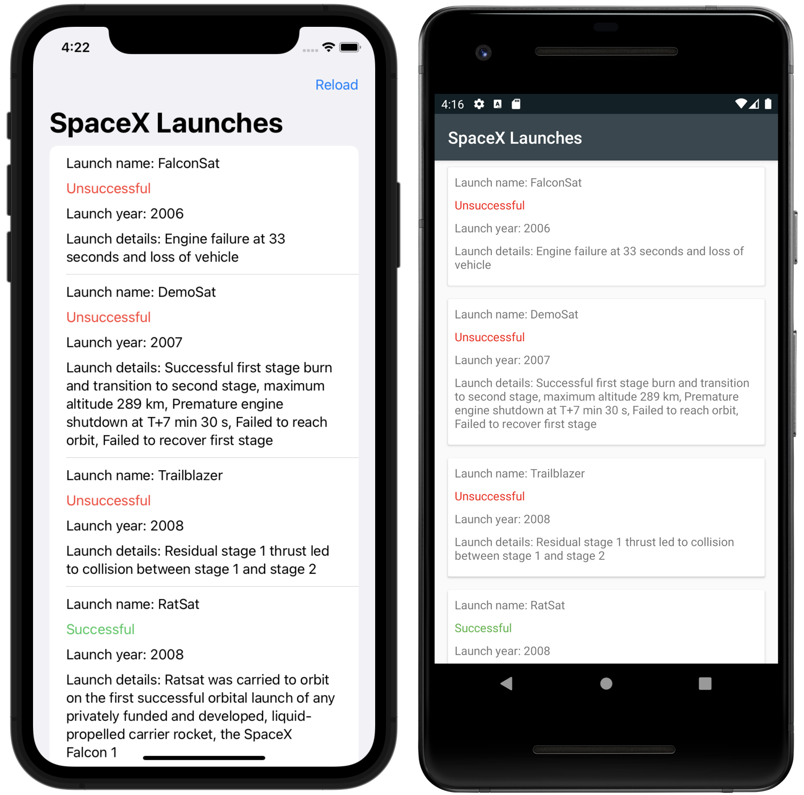

# SpaceX Launches - Kotlin Multiplatform Mobile

This application is based on the Kotlin tutorial
[Create a multiplatform app using Ktor and SQLDelight](https://kotlinlang.org/docs/multiplatform-mobile-ktor-sqldelight.html).

* The UI of both applications is native, using SwiftUI for iOS and Jetpack Compose for Android.
* It includes a module with shared code for both iOS and Android platforms. The
business logic and data access layers are implemented only once in the shared module.

The output is an app that retrieves data over the internet from the public
[SpaceX API](https://docs.spacexdata.com/?version=latest), saves it in a local database, and
displays a list of SpaceX rocket launches together with the launch date, results, and a detailed
description of the launch:

